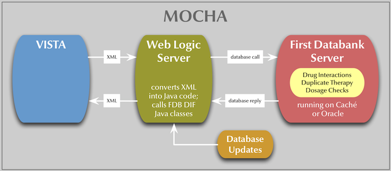
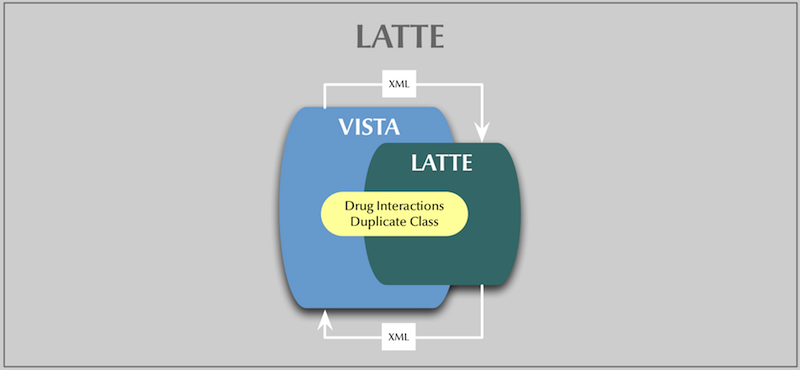

# Latte (MOCHA Bypass)
Latte is a KIDS build to apply to VISTA. It will allow you to run VISTA pharmacy and CPRS without the need for an external data source for drugs. Latte restores VISTA's ability to use its own drug files to do the drug-related order checks by leveraging the MOCHA interface and decoupling the interface from the First Databank Generic Code Number (GCN).

## Statement of Problem to Solve
Starting in Februrary 2011, Drug Order Checking in VISTA (drug interactions and duplicate drug classes) was replaced with web service calls to an external program that looks at First Databank data combined with VA customized data. This external program runs on  Oracle or Cache as databases and WebLogic as the server.  Without a license with First Databank, and the associated Oracle and WebLogic licenses for the middleware, you can no longer use VISTA for order checking. Furthermore, the ability to update CPRS and Pharmacy in your VISTA instance beyond February 2011 is impaired.

Three order checks are supported by MOCHA:
 * Drug-Drug Interaction Checks
 * Duplicate Therapy Checks
 * Dosage Checks

The general flow of data in MOCHA looks like this:

## Solution
Latte intercepts the XML from VISTA in the routine PSSHTTP and sends it to KBANLATT. KBANLATT reads the XML and performs the requested operations (Drug Interactions or Duplicate Therapy Checks) against the DRUG INTERACTION file or the VA DRUG CLASS file, as appropriate. It does not do dosage checks because VISTA does not support that. The KIDS build also includes changes to pharmacy routines to prevent their reliance on GCNs.

The drugs are extracted from the XML message and matched to VISTA using their
VUIDs, which are sent in the message.

The new flow looks like this:

## Limitations
Because the DRUG INTERACTION file does not have any text content on the
interaction, only the severity of the interaction is returned. Other content
expected from the MOCHA interface is replaced with pre-programmed values.

Dosage checks if requested always return an empty tag to prevent VISTA from
going into MOCHA error processing mode.

## User interaction changes.
No changes are performed to the user interface.

## Troubleshooting
Because VUIDs are used to match drugs back against VISTA, each drug that
will participate in a drug interaction should be matched against the 
National Drug File.

If you encounter the error ,UINVALIDVUID, this means that the VUID sent in the
XML message could not be matched back to the National Drug File. In my testing
this happens mostly due to corruption in the AMASTERVUID index of the VA
PRODUCT file. To fix this, re-index it. In once instance (DEXTROSE 5% INJ),
there were two MASTER entries for the drug, making the resolution impossible until one of these entries is marked as non-Master.

## Technical Components
### Dependencies
 * Kernel 8
 * Fileman 22
 * Pharmacy Patches below (MOCHA enhancements optional)
 > * MOCHA 1.0: PSS\*1\*117, PSO\*7\*251, PSJ\*5\*181, OR\*3\*272, PSO\*7\*375, PSS\*1\*163
 > * MOCHA 1.0 Enhancements 1: PSO\*7\*390, PSO\*7\*417, PSJ\*5\*260, PSJ\*5\*268,PSJ\*5\*288, PSS\*1\*164, PSS\*1\*169, OR\*3\*352
 * XML Processing Utilities 2.0 <https://github.com/shabiel/VISTA-xml-processing-utilities>

### Routine list

	Checksums
	Routine         Old         New        Patch List
	KBANLATT        n/a      80233460    
	KBANLWRT        n/a      114360032   
	PSODDPRE        n/a      135966725   **251,375,387,379,390,11310000**
	PSSHRIT         n/a      214661545   **136,168,164,11310000**
	PSSHRVAL        n/a      153337864   **136,11310000**
	PSSHTTP         n/a      14560152    **136,13100000**

Description of routines: KBANLATT is responsible for receiving the data from
PSSHTTP; and KBANLWRT is responsible for writing the data back.

### File list
None included.

### Exported Options
None included.

### Archiving and Purging
Not supported.

### Supported APIs

	EN^KBANLATT(RESULT,DOCHAND) ; Public; Main Latte XML parser routine                      
	 ; RESULT - Result to send back; By Ref 
	 ; DOCHAND - MXML Document Hand; By Val                                         

### External Interfaces, External Relations
None

### Internal relations
Only call is from PSSHTTP.

### Package wide-variables
None.

### Security
This software implements no security of its own. It inherits pharmacy security.
