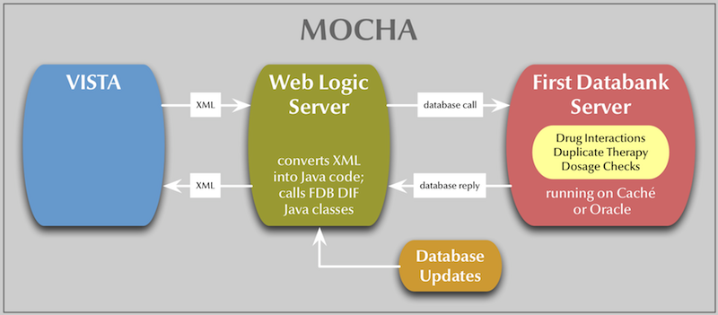

# Latte (MOCHA Bypass)
Latte is a KIDS build to apply to VISTA. It will allow you to run VISTA
pharmacy and CPRS without the need for an external data source for drugs.
Latte restores VISTA's ability to use its own drug files to do the drug-related
order checks by leveraging the MOCHA interface and decoupling the interface
from the First Databank Generic Code Number (GCN). Latte also allows you to
interface to alternate databases other than First Databank. In the latest
release (4.0) it allows you to interface to the following databases:
 
 * Native VistA Drug Data
 * Drug Information Technologies (DIT) (http://www.ditonline.com/).
 * ANSM, as translated and coded by Nancy Van Ness (http://ansm.sante.fr/)
 * Drugbank.ca, as provided by RxNav (https://rxnav.nlm.nih.gov/)

## Installation for Latte

* Latte 1.0 should not be installed. It's kept here for historical reasons.
* Latte 2.0 should be installed for all MOCHA 1.0 and MOCHA 1.0 Enhancements
  systems. [Follow this link]("KBAN LATTE 2.0/KBAN_LATTE_2P0.md").
* Latte 3.1 should be installed for all MOCHA 2.0 systems. [Follow this link](KBAN LATTE 3.0/KBAN_LATTE_3P0.md).
* Latte 4.0 should be installed with MOCHA 2.0 Enhancements 1. [Follow this link](https://github.com/shabiel/Latte/releases/tag/4.0).
* Mocha 2.1 has not been released yet. When it is released, Latte will be
updated to include the latest changes in the routines.


## License

(C) Sam Habiel 2014-2017.

ANSM Data Translation and codification (c) Nancy Van Ness 2014-2017, distributed under Apache 2.0.

ANSM Data (c) L’Agence nationale de sécurité du médicament et des produits de santé (ANSM).

Latte comes under an open source license (AGPL 3.0). A commercial license is
available for commercial VISTA users for whom an open source license is
inappropriate. The open source license text is available in the files you
received as LICENSE.txt. The commercial license is available as
LICENSE-COMMERCIAL.txt. If you are unsure which license applies to you, contact
the author at <sam.habiel@gmail.com>.

## Statement of Problem to Solve
Starting in February 2011, Drug Order Checking in VISTA (drug interactions and
duplicate drug classes) was replaced with web service calls to an external
program that looks at First Databank data combined with VA customized data.
This external program runs on Oracle or Cache as databases and WebLogic as the
server. Without a license with First Databank, and the associated Oracle and
WebLogic licenses for the middleware, you can no longer use VISTA for order
checking. Furthermore, the ability to update CPRS and Pharmacy in your VISTA
instance beyond February 2011 is impaired.

Three order checks are supported by MOCHA:

 * Drug-Drug Interaction Checks
 * Duplicate Therapy Checks
 * Dosage Checks

The general flow of data in MOCHA looks like this:



## Solution
Latte intercepts the XML from VISTA and sends it to Latte. Latte reads the XML
and performs the requested operations (Drug Interactions or Duplicate Therapy
Checks) against the configured data source. The data source can be set by the
parameter `C0D DRUG CHECK SERVICE`. If the parameter is not set, then the
default data source is VISTA.

```
------ Setting C0D DRUG CHECK SERVICE  for System: GOLD.VAINNOVATION.US ------
Value: RXNORM// ?

Enter a code from the list.

     Select one of the following:

          V         VISTA
          D         DIT
          A         ANSM
          R         RXNORM

Value: RXNORM// 
```

The drugs are extracted from the XML message and matched to VISTA using their
VUIDs, which are sent in the message.

The new flow looks like this:


## Limitations
Because the DRUG INTERACTION file does not have any text content on the
interaction, only the severity of the interaction is returned. Other content
expected from the MOCHA interface is replaced with pre-programmed values.

If you use the DIT interface, all the data is supplied back.

Dosage checks are currently disabled in VISTA. If they are enabled and
requested they always return an empty tag to prevent VISTA from going into
MOCHA error processing mode.

## Toggling between MOCHA and Latte
The parameter `C0D LATTE ENABLE?` is supplied to enable you to switch
between MOCHA and Latte. A value of `Yes` enables Latte. When you install
Latte, it's turned on by default.

## User interaction changes.
No changes are performed to the user interface.

### RxNorm Installation Warning
RxNorm installation is not needed except for using DIT.

*BECAUSE RXNORM DATA IN ^C0CRXN ARE REFERENCE DATA THAT CONTAIN 2.5 GB OF TOTAL
DATA, IT IS HIGHLY RECOMMENDED THAT YOU MAP ^C0CRXN TO AN UNJOURNALED REGION OF
YOUR MUMPS DATABASE. IT'S ALSO RECOMMENDED THAT YOU PUT IT IN A SEPARATE DATA
FILE OTHER THAN YOUR MAIN VISTA DATABASE. BOTH CACHE AND GT.M HAVE WAYS YOU CAN
ACCOMPLISH THAT.*
